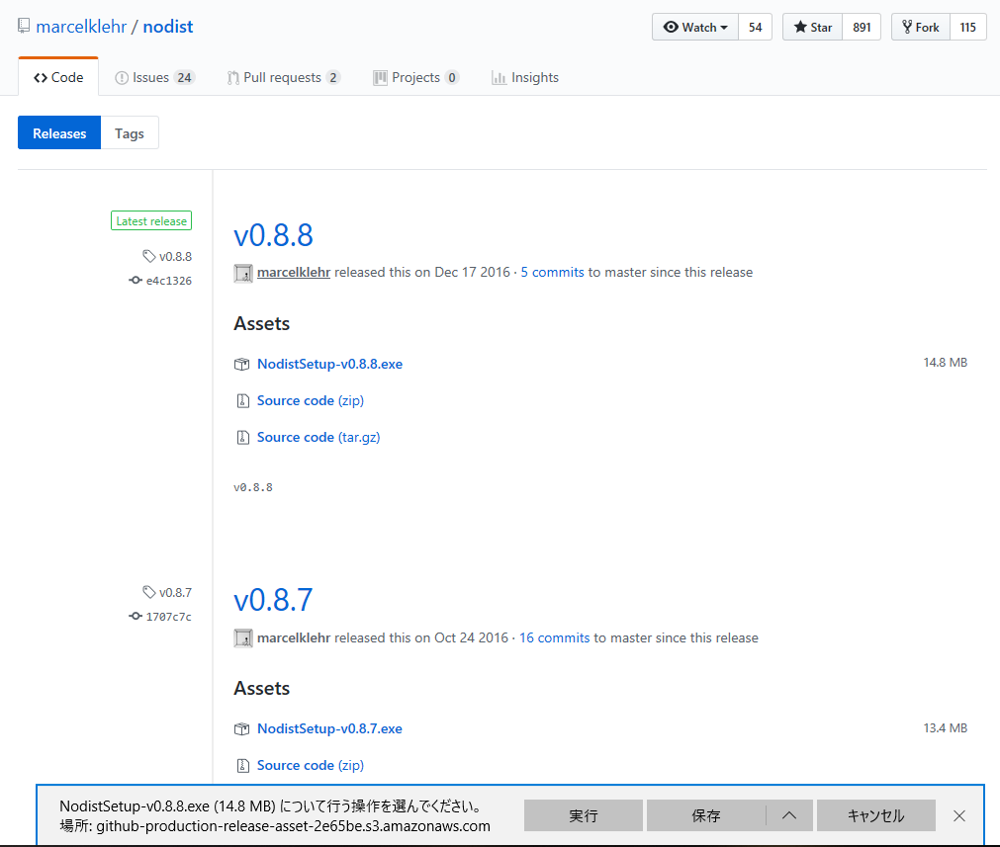
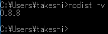
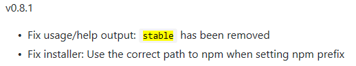
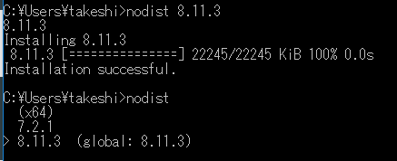
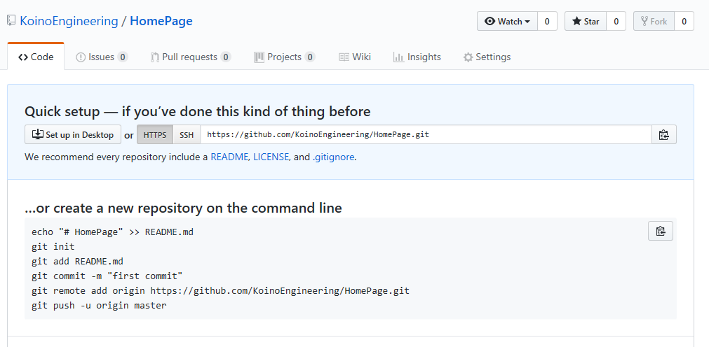
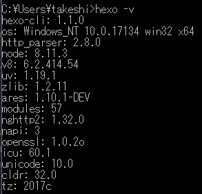

タイトルの通り、ホームページを構築したので、最初の記事の練習と備忘録として記事を作成  

ここは準備編

* * *

## 前提条件

-   OS：Windows10 Home
-   Githubアカウントあり
-   ssh設定済み

その他の環境など

-   エディタ：Atom
-   Gitのホームディレクトリを変更している
-   GitHubはssh設定済み

* * *

## 下準備１ node.js

Hexoを動作させるのにnode.jsが必要なためインストール  
今回はバージョン管理も必要かと思ったため[nodist](https://github.com/marcelklehr/nodist/releases)を使用することにした  
ちなみにMacの場合には[nodebrew](https://github.com/hokaccha/nodebrew)というものがあるらしい  

### Nodistのインストール

AssetsのSetup-v0.8.8.exeをダウンロードして手順に従ってインストールする  
  

### インストールの確認

  

### nodeの安定板をインストール

Hexoのインストール手順を見たら`$ nvm install stable`となっていたため最新の安定板をインストールしようとしたが、  
nodistで

    nodist stable

とやってみたら**エラーになった**  
Helpコマンド叩いてみてもlastestはいたが、stableキーワードはいなかった。   
よくよく調べてみると、  
  
nodistでは0.8.1でstableキーワードが**削除されていたようだ**。  
node.jsのサイトを見ると**8.11.3**が**Recommended For Most Usersとなっていた**ため、これをインストールすることにした  

## 下準備２ Github

今回はGithubのGithub Pagesを使用してホームページを作成するため、Github Pages用の設定を行う。

### 任意のリポジトリを作成する

このホームページに使用する用のリポジトリを作成する。 
今回はHomePageというリポジトリを作成した
  
※_username.github.io_ というリポジトリを作れば細かい設定をしなくてもGithub Pagesが使用できるが、  
**自動的にmasterブランチを使用する設定になってしまう** ため、今回は逆にやりづらいかもしれないと思いやめた  
(設定の変更は可能なので、できないことはない)  

## 下準備３　Hexoのインストール

[Hexo](https://hexo.io/docs/)のインストール手順に従って、以下のコマンドを実行し、インストールする

    $ npm install -g hexo-cli

-   インストールの確認  
    

## 下準備３ CircleCi

[circleci](https://circleci.com/signup/)に接続して**Sign Up with GitHub**からCircleCiを連携する

これで必要なものが全てそろった状態になった

準備編はここまで
