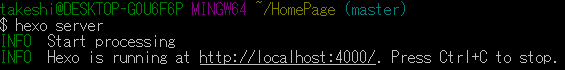
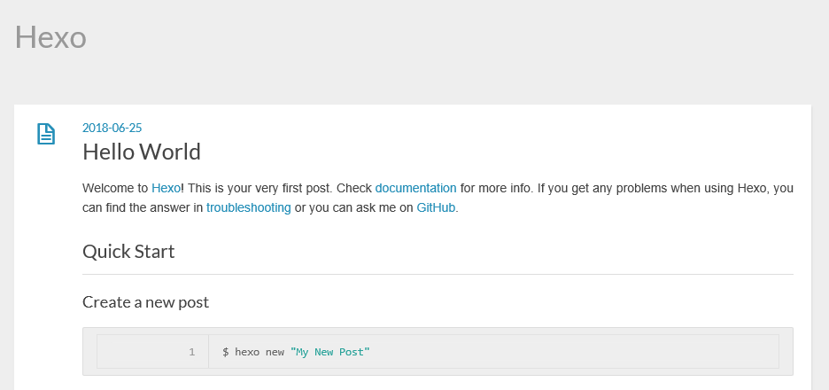
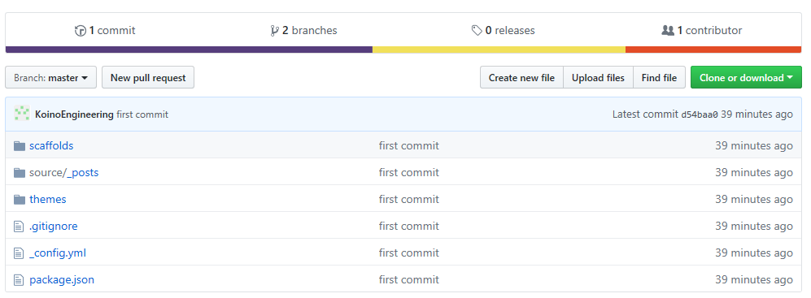
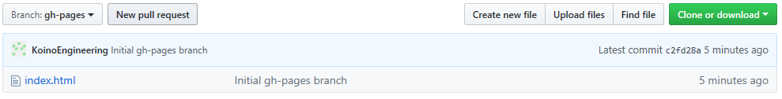
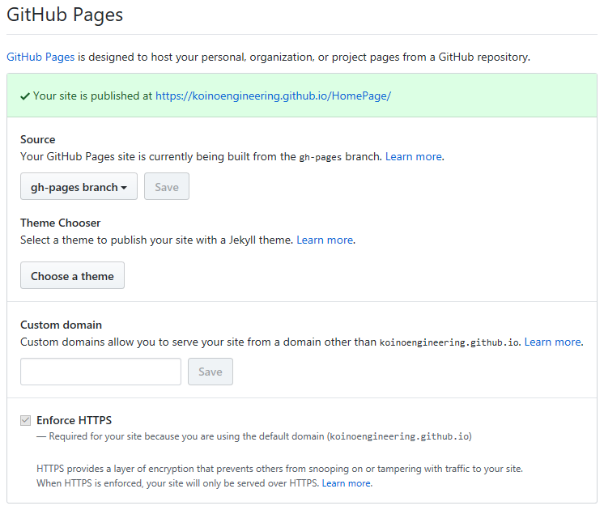
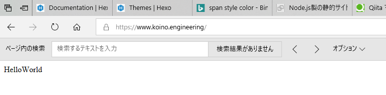
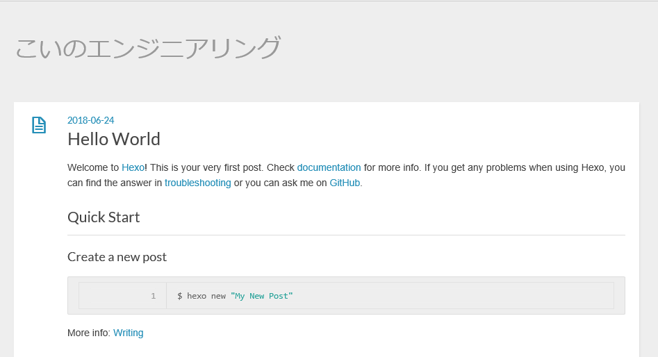
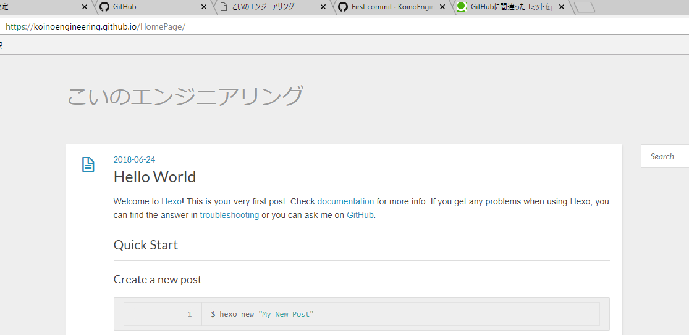

タイトルの通り、ホームページを構築したので、最初の記事の練習と備忘録として記事を作成  

ここはHexoの設定からGithub Pagesの設定までを行う

* * *

## Hexoの設定

### 初期化

ここで使用するフォルダをそのままGitHubにpushする予定なので、  
**gitのホームディレクトリ** で **GitHubに作成したリポジトリと同じ名前** で初期化  
そのままホームページのディレクトリに移動して画面を起動する

    $ Hexo init HomePage
    $ cd HomePage
    $ Hexo server

-   ホームページのディレクトリでコマンド実行  
      
-   URLにアクセス
    

### テーマの設定

テーマの変更をしたい場合はこちらを実施する。余談なので短く  
[Hexoのthemes](https://hexo.io/themes/)からテーマを選んで、そのテーマのリポジトリを見る  
手順に従ってthemesのディレクトリにCloneして`_config.yml`を修正するだけ。  
使ってないlandscapeは消しちゃってもいいかもしれないけど、  
デフォルトはなんかどこかから参照していることがあるので放置。_未調査_。

-   themesのディレクトリにClone  
          git clone <https://github.com/hexojs/hexo-theme-light.git> themes/light
-   `_config.yml`を修正  
          # Extensions
          ## Plugins: https://hexo.io/plugins/
          ## Themes: https://hexo.io/themes/
          theme: light
-   適用されていることを確認
    

## masterブランチへコミット

ここまでで作成したものをオリジナルのHexoの設定やマークダウンを管理するためにmasterブランチへ追加する

    $ git init
    $ git add .
    $ git commit -m "first commit"
    $ git remote add origin git@github.com:KoinoEngineering/HomePage.git
    $ git push -u origin master

## Github Pagesの設定(デプロイの準備)

### gh-pagesブランチの作成

Hexoのデプロイ先で、Github Pagesの本体となるgh-pagesブランチを作成する。  
中身は何でもいいので今回は`HelloWorld`だけの`index.html`を作成した  

    $ git checkout -b gh-pages  
    $ echo HelloWorld>index.html  
    $ git add index.html  
    $ git commit -m "make gh-pages branch"  
    $ git push origin gh-pages  
    $ git checkout master  

### リポジトリの設定を変更する

-   リポジトリのSettingsタブ＞GitHub Pagesにある、`Source`を`gh-pages`に変更して`save`を押す
-   `Enforce HTTPS`にチェックを入れる
    

この段階で表示されているURLに接続して、以下のようなっていれば設定はOK

## デプロイ

### \_config.ymlの設定

`_config.yml`に以下の設定をする  

    # Deployment
    ## Docs: https://hexo.io/docs/deployment.html
    deploy:
      type: git
      repo: git@github.com:KoinoEngineering/HomePage.git
      branch: gh-pages

また、今回はリポジトリ名が_username.github.io_ではないため、Github Pagesを設定した場合の  URLが  
<https://KoinoEngineering.github.io/HomePage>  
のようにサブディレクトリとなる。  
その設定がこちら

    # URL
    url: http://yoursite.com/HomePage
    root: /HomePage/

ついでに[ここ](https://hexo.io/docs/configuration.html)を見ながらサイトの設定もした

    # Site
    title: "こいのエンジニアリング"
    subtitle:
    description: "こいのエンジニアリングのホームページ"
    keywords:
    author: "濃野 剛"
    language: ja
    timezone: Asia/Tokyo

注意点

-   `_config.yml`に日本語を入力した個所は`"`で囲わないとHTML生成時にエラーになった。2バイト文字だから？
-   ファイルがSJISだったためか文字化けした。UTF-8に変換して解消

### 設定内容の確認

設定が正しく反映されているかを、もう一度画面を起動しなおして確認  

### デプロイの実施

→ [デプロイが失敗する場合](#デプロイが失敗する場合) はこちら

以下のコマンドをホームページのディレクトリで実行する

    $ hexo clean
    $ hexo generate
    $ hexo deploy

    または

    $ hexo deploy -g

#### デプロイが失敗する場合

`type:git`で`delpyer not found`のエラーが発生する場合  
プラグイン`hexo-deployer-git`が必要な模様

    $ npm install hexo-deployer-git --save

#### デプロイの確認

デプロイに成功したらGithub Pagesの設定に表示されているURLにアクセスして確認する
作成したホームページがきれいに表示できていれば成功

これで、Hexoを用いてホームページを作成するところまでが完了した
