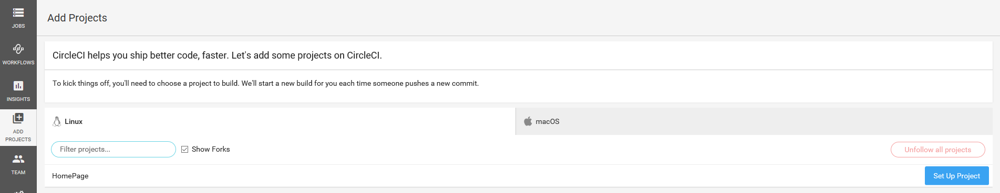
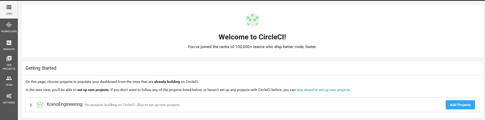
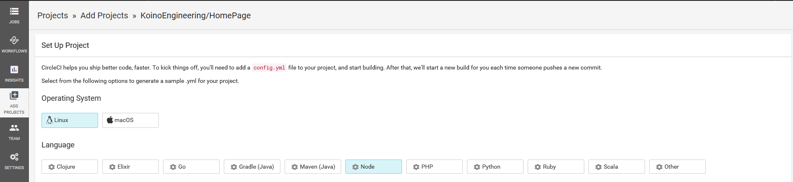
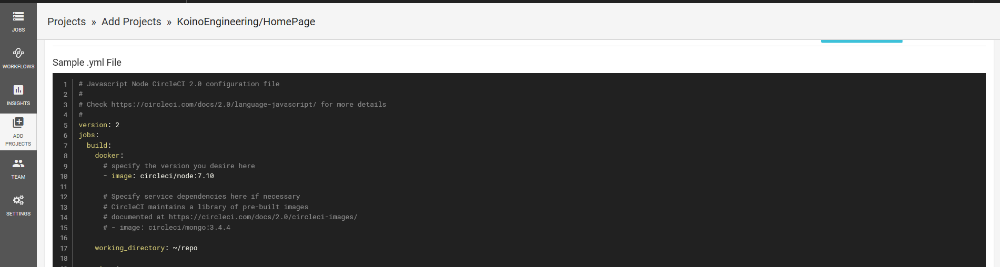
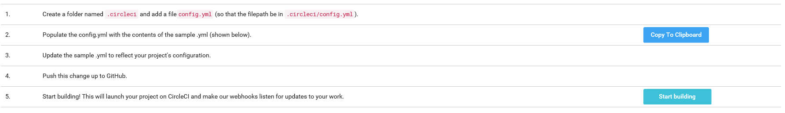
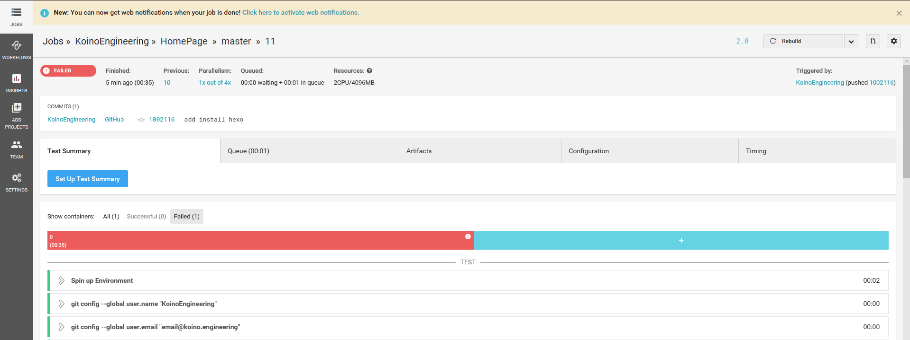

タイトルの通り、ホームページを構築したので、最初の記事の練習と備忘録として記事を作成  

CiecleCI編

* * *

## CircleCIと連携する

masterブランチへマークダウンをコミットした際に、  
今までしてきたHexoのデプロイの設定～デプロイまでを自動でやってもらうように設定する

### CircleCIの設定のデフォルトを取得する

- 実際にやっていないので不明だが、こちらを先にやった方がいいかもしれない  
→ [SSHの設定](#SSHの設定)

試しにCircleCIのサイトをいじっていたら、設定ファイルのデフォルトが出てきた  
使用がはじめてなこともあってこれをひな形に使用する

-   プロジェクトを追加を選択
    

-   プロジェクトを追加をクリック
    

-   言語の設定はNodeを選択
    

-   `circle.yml`のデフォルトの設定が表示される
    

### Github側の設定

`circle.yml`を作成し、masterブランチへpushする
上記で取得したデフォルトと、[CircleCI 2.0 Docs](https://circleci.com/docs/2.0/)を参考に、  
`circle.yml`をこのように編集した

    # Javascript Node CircleCI 2.0 configuration file
    #
    # Check https://circleci.com/docs/2.0/language-javascript/ for more details
    #
    version: 2
    jobs:
      build:
        docker:
          # specify the version you desire here
          - image: circleci/node:8.11.3
            environment:
              TZ: /usr/share/zoneinfo/Asia/Tokyo
          # Specify service dependencies here if necessary
          # CircleCI maintains a library of pre-built images
          # documented at https://circleci.com/docs/2.0/circleci-images/
          # - image: circleci/mongo:3.4.4

        working_directory: ~/HomePage
        branches:
          only:
            - master
        steps:
          - run: git config --global user.name "KoinoEngineering"
          - run: git config --global user.email "email@koino.engineering"
          - checkout
          - run: git clone https://github.com/hexojs/hexo-theme-light.git themes/light
          - run: npm install hexo
          - run: npm install hexo-cli
          - run: npm install hexo-deployer-git --save
          - run: ./node_modules/.bin/hexo clean
          - run: ./node_modules/.bin/hexo generate
          - run: ./node_modules/.bin/hexo deploy

設定の概要  

1.  Nodeのバージョンは8.11.3(準備時のもの)
2.  作業ディレクトリは`HomePage`(リポジトリ名)
3.  マスターブランチのpushにのみ反応する
4.  gitの設定
5.  チェックアウト
6.  themeをclone
7.  Hexo及びhexo-deployer-gitのインストール
8.  デプロイの実行

## CircleCI側の設定

[CircleCIの設定のデフォルトを取得する](#CircleCIの設定のデフォルトを取得する)でやったところの続きから  
(戻ってしまっていた場合にはもう一度やればOK)  

-   Start buildingをクリック  
    

-   成功時はCircleCIのサイトの方で以下のようにログが出力されていくが、正しく設定できていても  
    初回は`deploy`コマンドで**失敗する**  
        ※deploy以外のコマンドで失敗した場合には設定が誤っているので、ログ等を確認して修正する
        

-   SSHの設定  
    CircleCIが持っているSSHキーは読み取り権限しかもっていないため、pushできない  
    pushできるようにするために以下の設定を行う
-   Add Deploy Keyをクリック
    

-   SSHキーが追加される
    

## 自動デプロイ

ここまでの設定が正しくできていれば、masterブランチがpushされると  
CircleCIが自動でgh-pagesブランチへのデプロイを行うようになる

- 今回は試しにcircle.ymlに改行を追加して空更新してみた
